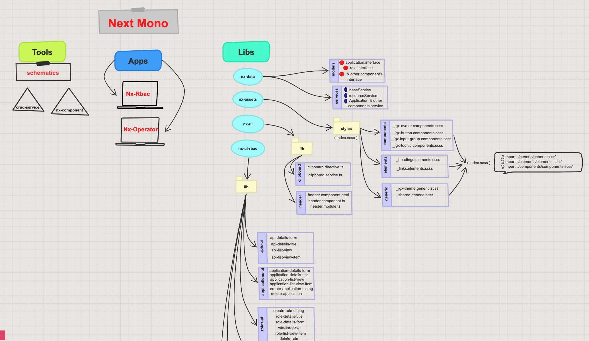

# Next Mono

## Which approach is used for this projects?

Mono repo used .. We accept apps and libs ..

## Why did we Accept this approach ?

there are several reasons.



## Setting up

Becoming a super hero is a fairly straight forward process:

```
$ npx create-nx-workspace@latest myworkspace
```


 Super-powers are granted randomly so please submit an issue if you're not happy with yours.


Once you're strong enough, save the world:

```
// Ain't no code for that yet, sorry
echo 'You got to trust me on this, I saved the world'
```

